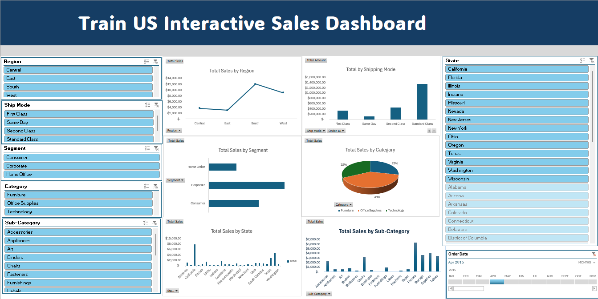

# Project 1

**Title:** [Train US Interactive Sales Dashboard](https://github.com/AyomideMartins/AyomideMartins.github.io/blob/main/train.xlsx)

**Tools Used:** Microsoft Excel (Pivot Table, Pivot Chart, Conditional Formatting, Timeline, Slicers, Power Query)

**Project Description:** This project involved analysing product data of a company to identify trends and patterns in sales performance for 2015-19. It is designed to provide a comprehensive overview of key performance metrics. This dashboard allows stakeholders to easily monitor and analyze the company’s performance across different regions, products, and time periods. The dashboard includes the following features:

Total Sales by Region: Visual representation of Sales broken down by each region.

Total Sales by Segment: A breakdown of the sales made by each segments, providing insights into sales trends over time.

Total Sales by Category: Displays the sales made by each category over time.

Total Sales by Sub-Category: Displays the sales made by each sub-category for indept breakdown of the products.

Total Sales by State: Highlights the total revenue generated in each state, showcasing the performance in different markets.

Additionally, the dashboard includes interactive slicers and timeline for:

Month: Filter the data to view performance for a specific month or range of months.

Country: Focus on specific states to analyze regional performance.

Shipmode: Drill down into the performance of individual shipment of the products.

**Key findings:** Regional Profitability: Identified the most profitable states, region, segments, category and highlighted regions where performance could be improved.

Seasonal Trends: Revealed patterns in sales and profit that correspond with seasonal events, allowing for more strategic planning.

Top-Performing Products: Highlighted which cookie products are driving the most revenue and profit, aiding in inventory and marketing decisions.

Sales Volatility: Analyzed monthly sales fluctuations to understand market dynamics and adjust business strategies accordingly.

This dashboard serves as a crucial tool for the cookies company’s management team, providing clear, actionable insights that drive informed decision-making and strategic planning.

**Dashboard Overview:** 

# Project 2

**Title:** Insurance Data 

**SQL Code:** [Insurance data-datainterogation and manipulation](https://github.com/AyomideMartins/AyomideMartins.github.io/blob/main/Insurance_data.sql)

**SQL Skills Used:** 

Data Retrieval (SELECT): Queried and extracted specific information from the database.

Data Aggregation (SUM, COUNT): Calculated totals, such as sales and quantities, and counted records to analyze data trends.

Data Filtering (WHERE, BETWEEN, IN, AND): Applied filters to select relevant data, including filtering by ranges and lists.
Data Source Specification (FROM): Specified the tables used as data sources for retrieval

**Project Description:**

**Technology used:** SQL server
